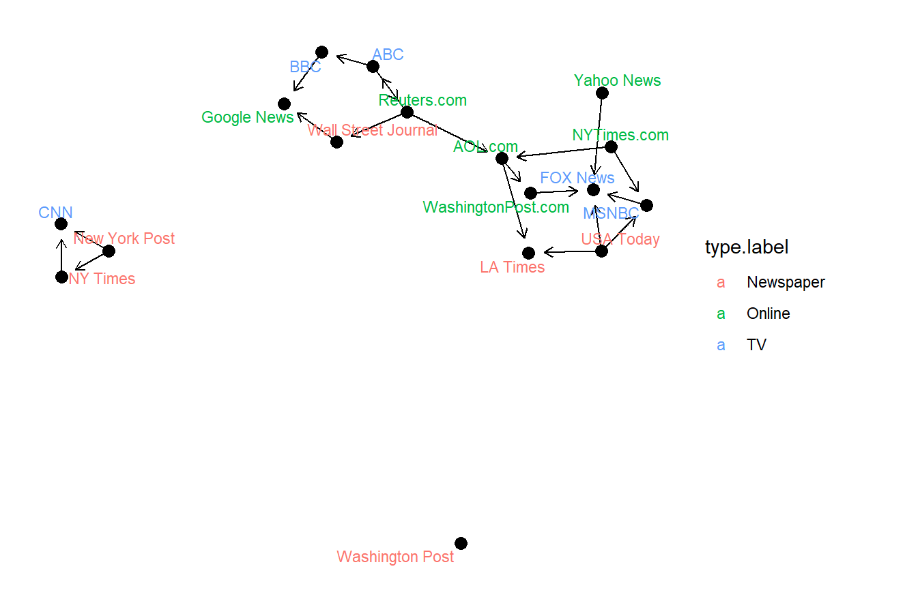

# Network Visualization

In this project I explore some tidier way to handle network by using `tidygraph` package. This package is analogous to `dplyr` and `tidyr` packages, 
but for handling graphs/network instead of dataframe. What I mean by that is, this package allows us to write code by using **piping** as in `dplyr`.
Then, I use `ggraph` package for grap/network visualization, which is analogous to `ggplot` package for dataframe visualization. In other words, they have
similar syntax structure. Which means, modification is given layer-by-layer by using symbol "+". 

The following visualization is one of the result in this project. The arrow from A to B means that there exists hyperlink(s) for accessing B directly 
from A.

Additionally, some algorithm related to network is also accessible through `tidygraph`, such as Djikstra's Algorithm for shortest path, as follows

For HTML version of the code and the result, click [here](https://www.rpubs.com/Steven_Surya/tidygraph-ggraph)
